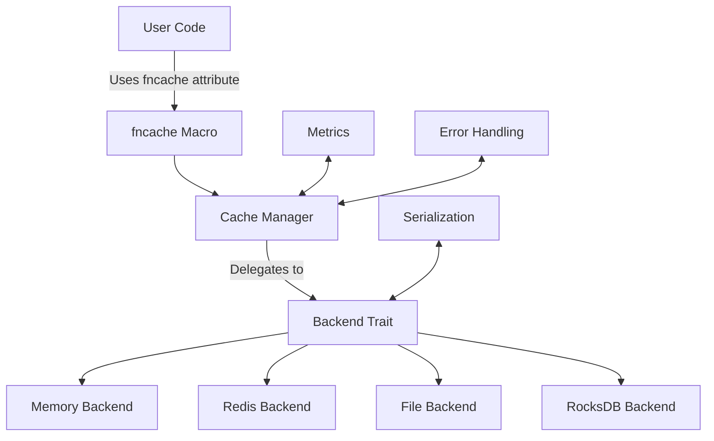

# fncache

A zero-boilerplate Rust library for function-level caching with pluggable backends (memory, file, Redis, etc.), inspired by `functools.lru_cache` and `request-cache`.

## Features

- **Attribute-based API**: Simple `#[fncache]` attribute for caching function results
- **Pluggable Backends**: Support for multiple storage backends
- **Async/Sync**: Seamless support for both synchronous and asynchronous functions
- **Type Safety**: Strong typing throughout the caching layer
- **Metrics**: Built-in instrumentation for cache performance monitoring

## Quick Start

Add `fncache` to your `Cargo.toml` with the desired features:

```toml
[dependencies]
fncache = { version = "0.1", features = ["memory"] }
```

### Basic Usage

```rust
use fncache::{
    backends::memory::MemoryBackend,
    init_global_cache,
    fncache,
    Result,
};

use bincode;
use futures;

#[fncache(ttl = 60)]
fn expensive_operation(x: u64) -> Result<u64> {
    println!("Performing expensive operation for {}", x);
    std::thread::sleep(std::time::Duration::from_secs(1));
    Ok(x * x)
}

#[tokio::main]
async fn main() -> Result<()> {
    let backend = Box::new(MemoryBackend::new());
    init_global_cache(*backend)?;
    
    let result1 = expensive_operation(5)?;
    println!("Result 1: {}", result1);
    
    let result2 = expensive_operation(5)?;
    println!("Result 2: {}", result2);
    
    Ok(())
}
```

### Async Function Example

```rust
use std::time::Duration;
use tokio::time::sleep;

#[fncache(ttl = 300)]
async fn fetch_data(id: &str) -> Result<String> {
    println!("Fetching data for {}", id);
    sleep(Duration::from_secs(1)).await;
    Ok(format!("Data for {}", id))
}
```

## Requirements

- Rust 1.56 or later
- For the `memory` feature (enabled by default):
  - `tokio` runtime
  - `bincode` for serialization
  - `futures` for async support

## Features

- **memory**: In-memory cache backend (enabled by default)
- **redis-backend**: Redis backend support (requires Redis server)
- **file-backend**: File-based persistent cache
- **rocksdb-backend**: RocksDB backend for high-performance persistent caching
- **metrics**: Enable performance metrics collection

## Roadmap

### Phase 1: MVP - In-Memory Cache (v0.1.0) ✓

- [x] Attribute macro: `#[fncache(ttl = 30)]`
- [x] Basic key derivation from function arguments
- [x] Thread-safe in-memory storage
- [x] Time-based expiry (TTL)
- [x] Basic metrics (hit/miss counts)

### Phase 2: Pluggable Backends (v0.2.0) ✓

- [x] `CacheBackend` trait definition
- [x] File-based backend (serde + bincode)
- [x] Redis backend using `redis-rs`
- [x] RocksDB backend
- [x] Custom serialization support
- [x] Feature flags for backends

### Phase 3: Advanced Features (v0.3.0)

- [x] Cache invalidation via tags/prefixes
- [ ] Background cache warming
- [ ] Advanced metrics (latency, size)
- [ ] Compile-time key derivation
- [ ] WASM support

### Phase 4: Production Ready (v1.0.0)

- [ ] Comprehensive documentation
- [ ] Benchmark suite
- [ ] Integration tests
- [ ] Performance optimization
- [ ] Security audit

## Architecture



## License

MIT
